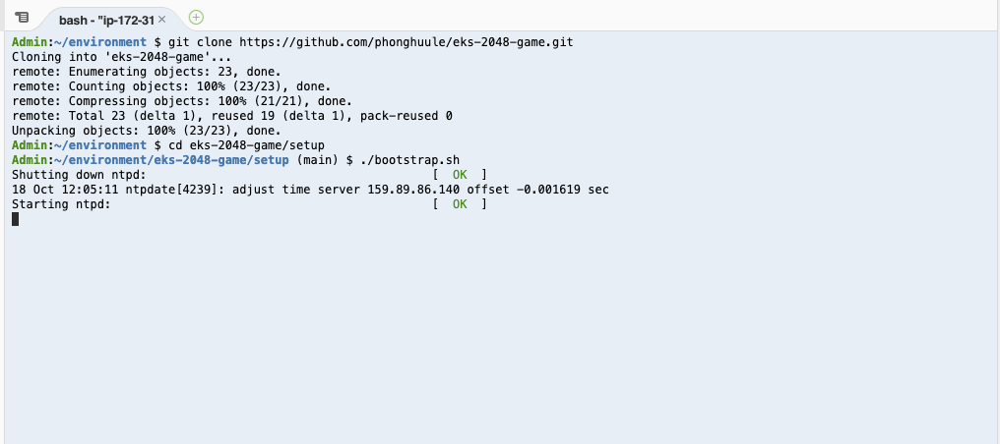

## Deploy and Expose Game 2048 on EKS using Kubernetes Ingress with AWS ALB Ingress Controller

This lab is provided as part of **[AWS Innovate Modern Applications Edition](https://aws.amazon.com/events/aws-innovate/modern-apps/)**, click [here]() to explore the full list of hands-on labs.

ℹ️ You will run this lab in your own AWS account. Please follow directions at the end of the lab to remove resources to avoid future costs.

### About this lab

[Kubernetes Ingress](https://kubernetes.io/docs/concepts/services-networking/ingress/) is an API resource that allows you manage external or internal HTTP(S) access to Kubernetes services running in a cluster. [Amazon Elastic Load Balancing Application Load Balancer (ALB)](https://aws.amazon.com/elasticloadbalancing/features/#Details_for_Elastic_Load_Balancing_Products) is a popular AWS service that load balances incoming traffic at the application layer (layer 7) across multiple targets. The lab walks through the steps of setting up ALB Ingress controller, deploying sample application (game 2048) and exposing the application publicly via ALB.

### How Kubernetes Ingress works with [aws-alb-ingress-controller](https://github.com/kubernetes-sigs/aws-alb-ingress-controller)

The following diagram details the AWS components that the aws-alb-ingress-controller creates whenever an Ingress resource is defined by the user. The Ingress resource routes ingress traffic from the Application Load Balancer(ALB) to the Kubernetes cluster.


## Setup

### Step 1 - Create Cloud9 environment via AWS CloudFormation

1. Log in your AWS Account
1. Click [this link](https://console.aws.amazon.com/cloudformation/home?region=us-east-1#/stacks/new?stackName=EKS-ALB-2048-Game&templateURL=https://aws-innovate-modern-applications.s3.amazonaws.com/eks-2048-game/cloud9.yaml) and open a new browser tab
1. Click *Next* again to the stack review page, tick **I acknowledge that AWS CloudFormation might create IAM resources** box and click *Create stack*.
  
  

4. Wait for a few minutes for stack creation to complete.
5. Select the stack and note down the outputs (*Cloud9EnvironmentId* & *InstanceProfile*) on *outputs* tab for next step.

  

### Step 2 - Assign instance role to Cloud9 instance

1. Launch [AWS EC2 Console](https://console.aws.amazon.com/ec2/v2/home?#Instances).
2. Use stack output value of *Cloud9EnvironmentId* as filter to find the Cloud9 instance.

  

3. Right click the instance, *Security* -> *Modify IAM Role*.
4. Choose the profile name matches to the *InstanceProfile* value from the stack output, and click *Apply*.

  

### Step 3 - Disable Cloud9 Managed Credentials

1. Launch [AWS Cloud9 Console](https://console.aws.amazon.com/cloud9/home?region=us-east-1#)
1. Locate the Cloud9 environment created for this lab and click "Open IDE". The environment title should start with *EKSCloud9*.
1. At top menu of Cloud9 IDE, click *AWS Cloud9* and choose *Preferences*.
1. At left menu *AWS SETTINGS*, click *Credentials*.
1. Disable AWS managed temporary credentials:

  

### Step 4 - Bootstrap lab environment on Cloud9 IDE

Run commands below on Cloud9 Terminal to clone this lab repository and bootstrap the lab:

```
git clone https://github.com/phonghuule/eks-2048-game.git
cd eks-2048-game/setup
./bootstrap.sh
```

The *bootstrap.sh* script will:

- Upgrade AWS CLI to latest version.
- Install kubectl, [eksctl](https://eksctl.io/).
- Create an EKS cluster with eksctl.
- Set up [IAM roles for service accounts](https://docs.aws.amazon.com/eks/latest/userguide/iam-roles-for-service-accounts.html) for ALB Ingress Controller.

  

Note: If the script is stuck at creating SSH Key Pair, please hit enter, the script will continue

## Lab

### Step 0

In Cloud 9 environment, maximize the Terminal, and load the profile with this command:

```
source ~/.bash_profile
```

### Step 1

Create a Kubernetes service account named alb-ingress-controller in the kube-system namespace, a cluster role, and a cluster role binding for the ALB Ingress Controller to use with the following command.

```
sudo chmod +x /home/ec2-user/bin/kubectl
kubectl apply -f https://raw.githubusercontent.com/kubernetes-sigs/aws-alb-ingress-controller/v1.1.4/docs/examples/rbac-role.yaml
```
### Step 2

ALB Ingress Controller needs to know the EKS cluster name. Run the command below to download, update the deployment manifest and deploy the ALB Ingress Controller .

```
curl -sS "https://raw.githubusercontent.com/kubernetes-sigs/aws-alb-ingress-controller/v1.1.4/docs/examples/alb-ingress-controller.yaml" \
     | sed "s/# - --cluster-name=devCluster/- --cluster-name=eks-alb-2048game/g" \
     | kubectl apply -f -
```

### Step 3

Confirm that the ALB Ingress Controller is running with the following command. 

```
kubectl get pods -n kube-system
```

Expected output:

```
NAME                                      READY   STATUS    RESTARTS   AGE
alb-ingress-controller-55b5bbcb5b-bc8q9   1/1     Running   0          56s
```

### Step 4

Create a namespace for 2048 game.

```
kubectl apply -f https://raw.githubusercontent.com/kubernetes-sigs/aws-alb-ingress-controller/v1.1.4/docs/examples/2048/2048-namespace.yaml
```

Verify the namespace has been created:

```
kubectl get ns
```

Expected output:

```
NAME              STATUS   AGE
2048-game         Active   42h
default           Active   42h
kube-node-lease   Active   42h
kube-public       Active   42h
kube-system       Active   42h
```

### Step 5

Create a deployment to run 2048 game application pods.

```
kubectl apply -f https://raw.githubusercontent.com/kubernetes-sigs/aws-alb-ingress-controller/v1.1.4/docs/examples/2048/2048-deployment.yaml
```

Verify the deployment has been created:

```
kubectl get deployment -n 2048-game
```

Expected output:

```
NAME              READY   UP-TO-DATE   AVAILABLE   AGE
2048-deployment   5/5     5            5           42h
```

### Step 6

Create a service to abstract 2048 game application pods.

```
kubectl apply -f https://raw.githubusercontent.com/kubernetes-sigs/aws-alb-ingress-controller/v1.1.4/docs/examples/2048/2048-service.yaml
```

Verify the service has been created:

```
kubectl get service -n 2048-game
```

Expected output:

```
NAME           TYPE       CLUSTER-IP      EXTERNAL-IP   PORT(S)        AGE
service-2048   NodePort   10.100.49.101   <none>        80:32667/TCP   42h
```

### Step 7

Deploy ALB Ingress resource to expose 2048 Game via AWS Application Load Balancer.

```
kubectl apply -f https://raw.githubusercontent.com/kubernetes-sigs/aws-alb-ingress-controller/v1.1.4/docs/examples/2048/2048-ingress.yaml
```

After a few minutes, verify that the Ingress resource was created with the following command. 

```
kubectl get ingress/2048-ingress -n 2048-game
```

Expected output:

```
NAME           HOSTS   ADDRESS                                                                     PORTS   AGE
2048-ingress   *       7dfe79d3-2048game-2048ingr-6fa0-35333457.ap-southeast-2.elb.amazonaws.com   80      41h
```

To debug, run the following command to view the Ingress controller log:

```
kubectl logs -n kube-system   deployment.apps/alb-ingress-controller
```

### Step 8

Navigate to [AWS Console Load Balancer page](https://console.aws.amazon.com/ec2/v2/home#LoadBalancers:sort=loadBalancerName) to see the Load Balancer created by ALB Ingress Controller according to the Ingress resource. Wait for Load Balancer to be **active** before heading to next step.


### Step 9

Open a browser and navigate to the ALB endpoint (shown in ADDRESS field from the previous command `kubectl get ingress/2048-ingress -n 2048-game` output or from AWS Load Balancer Console) to see the 2048 game application.


## Clean up

### Step 1

Run *cleanup.sh* from Cloud 9 Terminal to delete EKS cluster and its resources. Cleanup script will:

- Delete all the resources installed in previous steps.
- Delete the EKS cluster created via bootstrap script.

```
./cleanup.sh
```

### Step 2

Double check the EKS Cluster stack created by eksctl was deleted:

- Launch [AWS CloudFormation Console](https://console.aws.amazon.com/cloudformation/home)
- Check if the stack **eksctl-eks-alb-2048game-cluster** still exists.
- If exists, click this stack, in the stack details pane, choose *Delete*.
- Select *Delete* stack when prompted.

### Step 3

Delete the Cloud 9 CloudFormation stack named **EKS-ALB-2048-Game** from AWS Console:

- Launch [AWS CloudFormation Console](https://console.aws.amazon.com/cloudformation/home)
- Select stack **EKS-ALB-2048-Game**.
- In the stack details pane, choose *Delete*.
- Select *Delete* stack when prompted.

## Reference

- [Kubernetes Ingress with AWS ALB Ingress Controller](https://aws.amazon.com/blogs/opensource/kubernetes-ingress-aws-alb-ingress-controller/)
- [Github repository for AWS ALB Ingress Controller](https://github.com/kubernetes-sigs/aws-alb-ingress-controller)

## Survey
Please help us to provide your feedback [here](https://amazonmr.au1.qualtrics.com/jfe/form/SV_6x7UgBL9FHn59dA?Session=HOL4).
Participants who complete the surveys from AWS Innovate Online Conference - Modern Applications Edition will receive a gift code for USD25 in AWS credits. AWS credits will be sent via email by 30 November, 2021.
